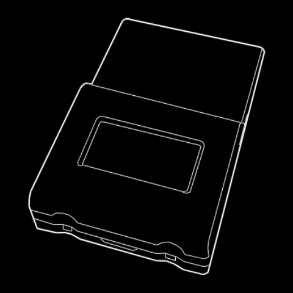
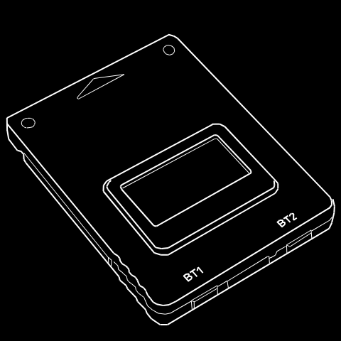
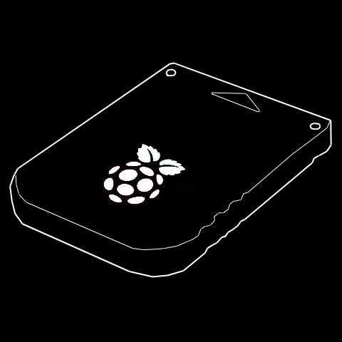

# Firmware Download

> choose your device:

<!--
HELLO
-->

    

      
    

    

      <h2 class="text-normal lh-condensed">SD2PSX</h2>
      
a <a href="https://github.com/sd2psx/pcb">DIY SD2PSX</a> or by <a href="https://store.phenommod.com/?product=sd2psx">PhenomMods</a>

      <a class="color-fg-muted text-small">The classic one</a>
      <!--<a class="" href="https://github.com/sd2psXtd/firmware/releases/download/1.2.0/sd2psx.uf2">Download firmware</a>--->
    

      <a class="BtnGroup-item btn btn-outline" type="button"href="https://github.com/sd2psXtd/firmware/releases/download/1.2.0/sd2psx.uf2">Firmware</a>
      <a class="BtnGroup-item btn btn-outline" type="button"href="https://github.com/sd2psXtd/firmware/releases/download/1.2.0/sd2psx-debug.uf2">Debug Firmware</a>
    

  

    

        
    

    

      <h2 class="text-normal lh-condensed">PSXMemCard Gen2</h2>
      
SD2PSX: produced by BitFunx!

      <a class="color-fg-muted text-small">Professional production by a company known to make quality PS2 peripherals</a>
    

        <a class="BtnGroup-item btn btn-outline" type="button"href="https://github.com/sd2psXtd/firmware/releases/download/1.2.0/sd2psx.uf2">Firmware</a>
        <a class="BtnGroup-item btn btn-outline" type="button"href="https://github.com/sd2psXtd/firmware/releases/download/1.2.0/sd2psx-debug.uf2">Debug Firmware</a>
    

    

    

        
    

    

      <h2 class="text-normal lh-condensed">PSXMemCard Gen1</h2>
      
Made by bitfunx, enhanced by SD2PSX Firmware

      <a class="color-fg-muted text-small">Same capabilities than SD2PSX. at a lower price, but without OLED, Buttons or PSRAM</a>
    

        <a class="BtnGroup-item btn btn-outline" type="button"href="https://github.com/sd2psXtd/firmware/releases/download/1.2.0/psxmemcard.uf2">Firmware</a>
        <a class="BtnGroup-item btn btn-outline" type="button"href="https://github.com/sd2psXtd/firmware/releases/download/1.2.0/psxmemcard-debug.uf2">Debug Firmware</a>
    

    

    

        
    

    

      <h2 class="text-normal lh-condensed">PicoMemcard+</h2>
      
Made by dangiu, enhanced by SD2PSX Firmware

      <a class="color-fg-muted text-small">DIY project built on top of rp2040-zero</a>
    

        <a class="BtnGroup-item btn btn-outline" type="button" href="https://github.com/sd2psXtd/firmware/releases/download/1.2.0/pmc+.uf2">Firmware Pico</a>
        <a class="BtnGroup-item btn btn-outline" type="button" href="https://github.com/sd2psXtd/firmware/releases/download/1.2.0/pmczero.uf2">Firmware Zero</a>
    

    

        <a class="BtnGroup-item btn btn-outline" type="button" href="https://github.com/sd2psXtd/firmware/releases/download/1.2.0/pmc+-debug.uf2">Debug Firmware Pico</a>
        <a class="BtnGroup-item btn btn-outline" type="button" href="https://github.com/sd2psXtd/firmware/releases/download/1.2.0/pmczero-debug.uf2">Debug Firmware Zero</a>
        <!--a class="BtnGroup-item btn btn-outline" type="button" href="https://github.com/dangiu/PicoMemcard?tab=readme-ov-file#picomemcard-vs-picomemcard">Project GitHub</a-->
    

    

