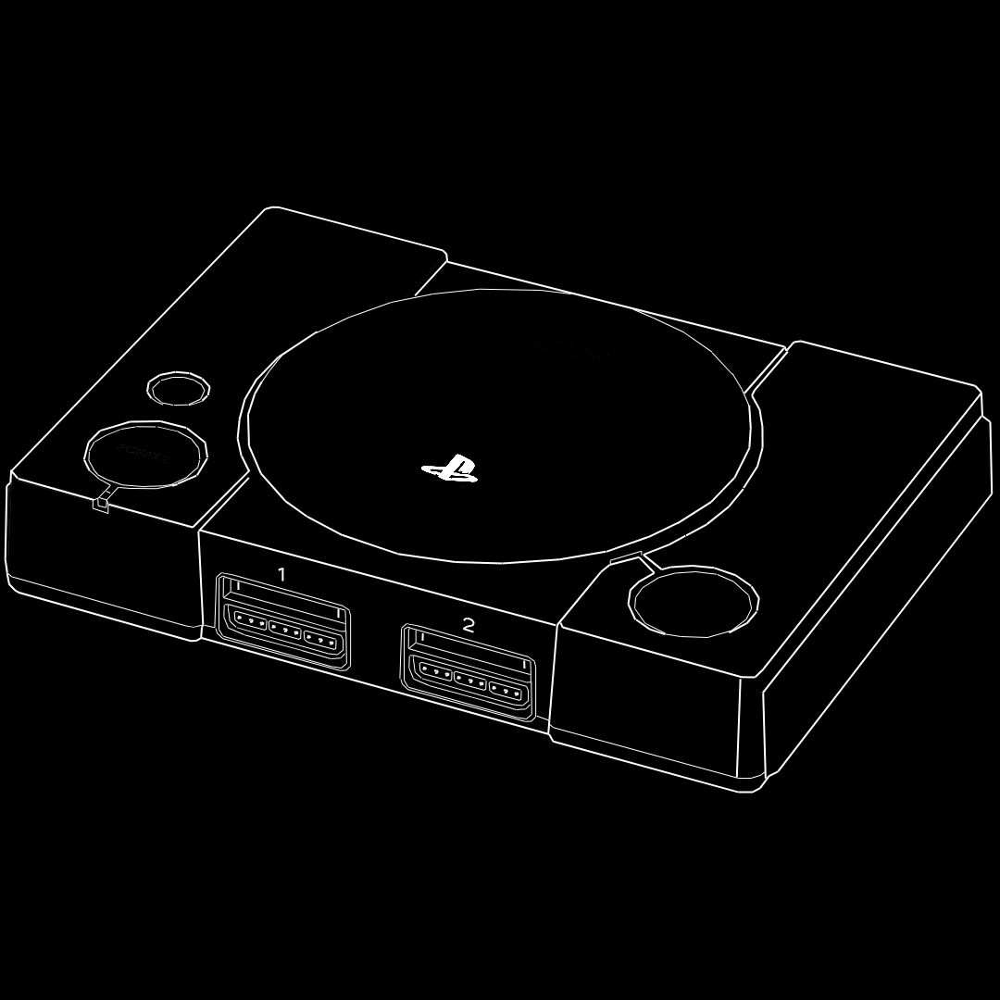
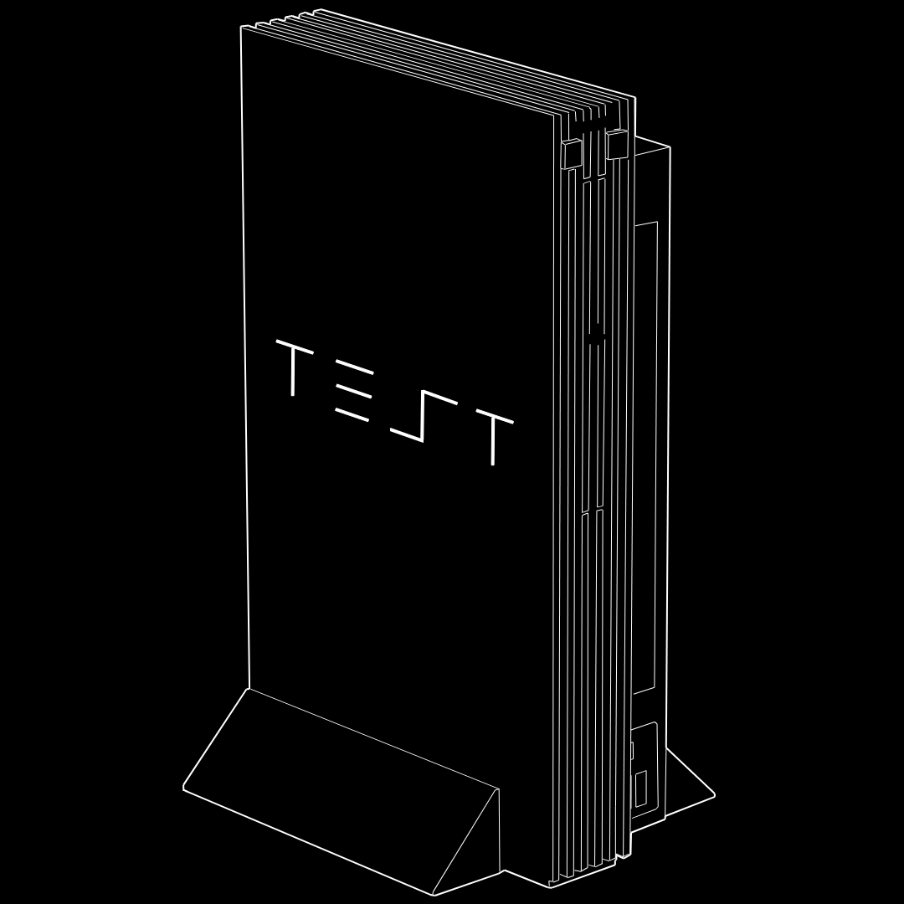

# Homebrew Entrypoints

<a class="SideNav-item" href="#ps1"> PS1</a>
<a class="SideNav-item" href="#for-retail-ps2"> Retail PS2</a>
<a class="SideNav-item" href="#for-developer-ps2"> Developer PS2</a>
<a class="SideNav-item" href="#for-arcade-ps2"> Arcade PS2</a>
<a class="SideNav-item" href="#pre-setup-sd-card-structure"> Pre-Setup SD Card structure</a>

## PS1

> Find super fast FreePSXBoot for sd2psXtd firmware >= 1.1 here:

    <a class="BtnGroup-item btn btn-outline" type="button" href="https://github.com/sd2psXtd/FreePSXBoot/releases/tag/sd2psXtd-1.1">FreePSX Boot</a>

## PS2

Download ready to use images of well known homebrew entry!

any bundled homebrew inside the image (OPL or wLE) are compatible with MMCE!

### For Retail PS2
> If you own a retail PS2 (`SCPH-` or `DESR-`) model, use this:

System Update exploits:

    <a class="BtnGroup-item btn btn-outline" type="button" href="https://github.com/sd2psXtd/sd2psXtd.github.io/releases/download/latest/FMCB-1966.mcd">FreeMcBoot 1.966</a>
    <a class="BtnGroup-item btn btn-outline" type="button" href="https://github.com/sd2psXtd/sd2psXtd.github.io/releases/download/latest/FMCB-1965.mcd">FreeMcBoot 1.965</a>
    <a class="BtnGroup-item btn btn-outline" type="button" href="https://github.com/sd2psXtd/sd2psXtd.github.io/releases/download/latest/FMCB-1964.mcd">FreeMcBoot 1.964</a>
    <a class="BtnGroup-item btn btn-outline" type="button" href="https://github.com/sd2psXtd/sd2psXtd.github.io/releases/download/latest/FMCB-1963.mcd">FreeMcBoot 1.963</a>
    <a class="BtnGroup-item btn btn-outline" type="button" href="https://github.com/sd2psXtd/sd2psXtd.github.io/releases/download/latest/FMCB-1953.mcd">FreeMcBoot 1.953</a>
    <a class="BtnGroup-item btn btn-outline" type="button" href="https://github.com/sd2psXtd/sd2psXtd.github.io/releases/download/latest/PS2BBL.mcd">PS2BBL</a>

Other exploits:

    <a class="BtnGroup-item btn btn-outline" type="button" href="https://sd2psx.net/assets/exploit/OpenTuna-2.0.0.mcd">OpenTuna</a>

## For **Developer** PS2
> If you own a developer PS2 (`DTL-H` or `DTL-T`) model, use this:

For models that supports system updates

<!--

    <a class="BtnGroup-item btn btn-outline" type="button" href="https://github.com/sd2psXtd/sd2psXtd.github.io/releases/download/latest/PS2BBL-DEX.mcd">PS2BBL</a>

-->

> SOON

For models that don't support system update (eg: `SCPH-1x0xx` and `DTL-H3x0xx`)

    <a class="BtnGroup-item btn btn-outline" type="button" href="https://sd2psx.net/assets/exploit/OpenTuna-2.0.0.mcd">OpenTuna</a>
    <!--<a class="BtnGroup-item btn btn-outline" type="button" href="https://github.com/sd2psXtd/sd2psXtd.github.io/releases/download/latest/PS2BBL-DEX.mcd">PS2BBL</a>-->

### For Arcade PS2
> If you own a Namco System 246, System 256 or Konami python1:

    <a class="BtnGroup-item btn btn-outline" type="button" href="https://github.com/sd2psXtd/sd2psXtd.github.io/releases/download/latest/wLaunchELF_Arcade.mcd">wLaunchELF 4.43x_isr_coh</a>

### Pre-Setup SD Card structure

Download a complete Exploit-ready SD-Card structure. 
Just unzip to your SD-Card root!

    <a class="BtnGroup-item btn btn-outline" type="button" href="https://github.com/sd2psXtd/sd2psXtd.github.io/releases/download/latest/MemoryCards.zip">SD card structure</a>

