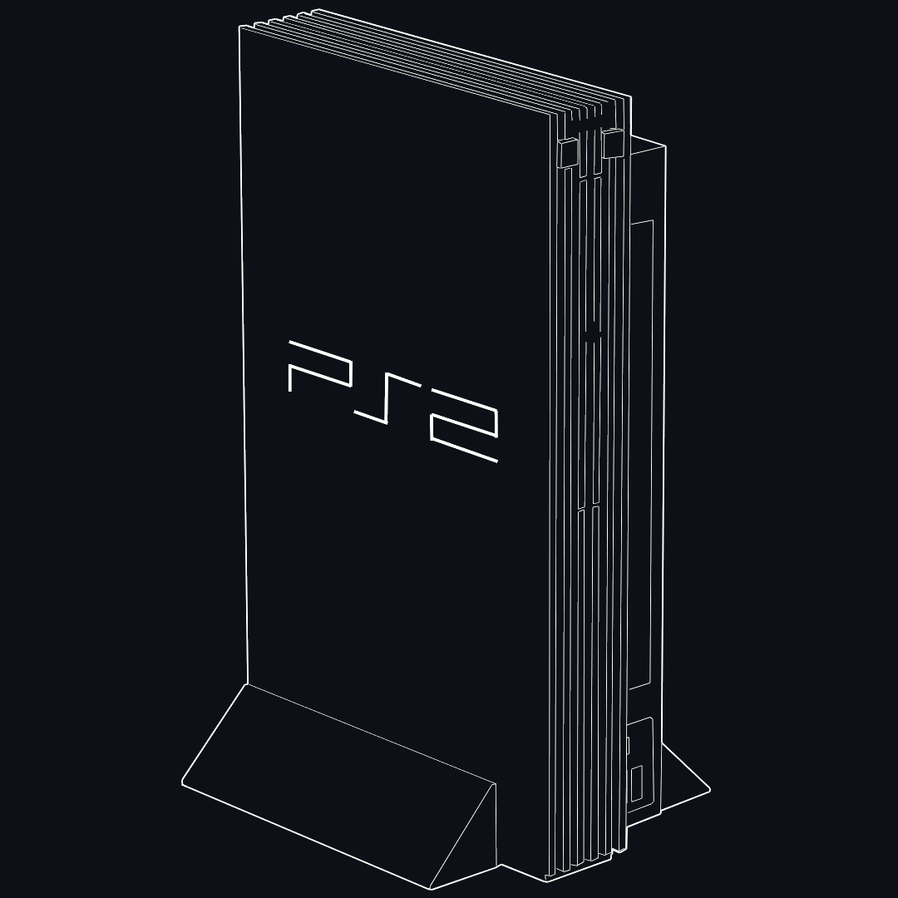
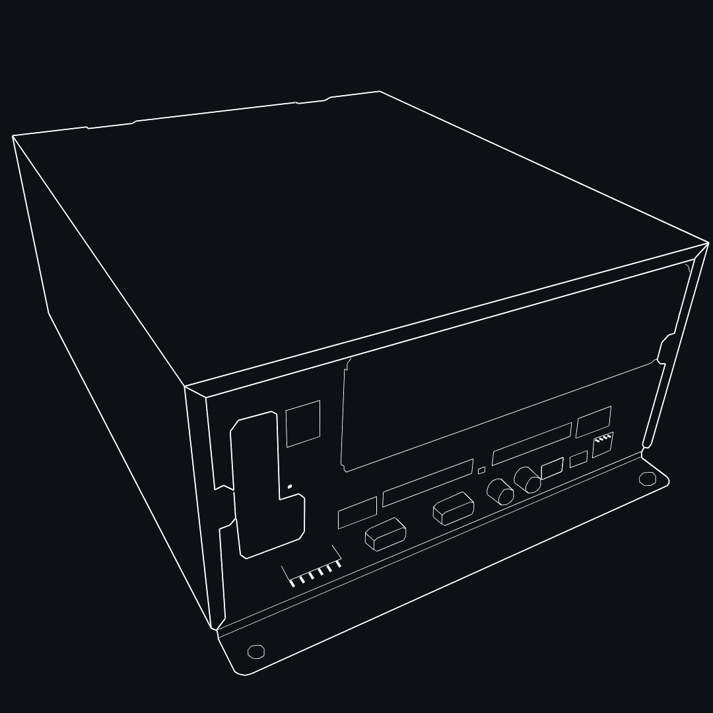

# Homebrew Entrypoints

Download ready to use images of well known homebrew entry!

any bundled homebrew inside the image (OPL or wLE) are compatible with MMCE!

## For Retail PS2
> If you own a retail PS2 (`SCPH-` or `DESR-`) model, use this:

    <a class="BtnGroup-item btn btn-outline" type="button" href="https://github.com/sd2psXtd/sd2psXtd.github.io/releases/download/latest/FMCB-1966.mcd">FreeMcBoot 1.966</a>
    <a class="BtnGroup-item btn btn-outline" type="button" href="https://github.com/sd2psXtd/sd2psXtd.github.io/releases/download/latest/FMCB-1965.mcd">FreeMcBoot 1.965</a>
    <a class="BtnGroup-item btn btn-outline" type="button" href="https://github.com/sd2psXtd/sd2psXtd.github.io/releases/download/latest/FMCB-1964.mcd">FreeMcBoot 1.964</a>
    <a class="BtnGroup-item btn btn-outline" type="button" href="https://github.com/sd2psXtd/sd2psXtd.github.io/releases/download/latest/FMCB-1963.mcd">FreeMcBoot 1.963</a>
    <a class="BtnGroup-item btn btn-outline" type="button" href="https://github.com/sd2psXtd/sd2psXtd.github.io/releases/download/latest/FMCB-1953.mcd">FreeMcBoot 1.953</a>
    <a class="BtnGroup-item btn btn-outline" type="button" href="https://github.com/sd2psXtd/sd2psXtd.github.io/releases/download/latest/PS2BBL.mcd">PS2BBL</a>

## For Arcade PS2
> If you own a Namco System 246, System 256 or Konami python1:

    <a class="BtnGroup-item btn btn-outline" type="button" href="https://github.com/sd2psXtd/sd2psXtd.github.io/releases/download/latest/wLaunchELF_Arcade.mcd">wLaunchELF 4.43x_isr_coh</a>

